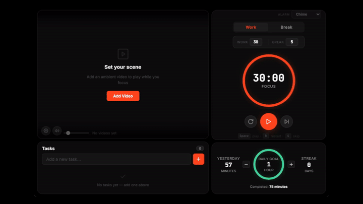

<h1 align="center">Flowdoro</h1>

<p align="center"><em>Focus in motion</em></p>

<p align="center">
  A Pomodoro timer that plays your own ambient / lo-fi video while you focus —
  with tasks and daily progress, in one distraction-free window.
</p>

<p align="center">
  <a href="https://github.com/Keemoz05/Flowdoro/releases/latest"><b>⬇ Download for Windows</b></a>
  ·
  <a href="https://github.com/Keemoz05/Flowdoro/issues">Report a bug</a>
</p>

---

<!--
  DEMO GIF — replace the image below with a real 10–15s screen recording.
  Suggested clip: start the timer → video plays → add a task → break flips the accent color.
  Record with ScreenToGif (free, Windows), save as docs/demo.gif, then this line shows it.
-->
<p align="center">
  
</p>

## What it is

Flowdoro is a lightweight desktop app (built with [Tauri](https://tauri.app)) that combines four focus tools in a single mosaic layout:

- **Pomodoro Timer** — Work/Break cycle with an SVG progress ring, auto-cycling, and keyboard shortcuts
- **Ambient Video Player** — Loop your own local videos or YouTube URLs as a focus backdrop, with a volume slider
- **Task Manager** — Add, complete, and delete tasks with persistent storage
- **Daily Progress Tracker** — Focus minutes, an adjustable daily goal, streaks, and yesterday's total

## Features

- Customizable work/break durations and a choice of alarm sounds (chime, bell, soft beep)
- Ambient video syncs with the timer — plays when you work, pauses when you stop
- Video library with up to 8 slots (local files + YouTube URLs)
- Native desktop notification when a session ends
- Keyboard shortcuts: `Space` (play/pause), `R` (restart), `S` (skip)
- First-run guided tour

## Download & install (Windows)

1. Grab the latest **`.exe`** (or `.msi`) from the [**Releases**](https://github.com/Keemoz05/Flowdoro/releases/latest) page.
2. Run it. Because Flowdoro isn't code-signed yet, Windows SmartScreen may show
   **"Windows protected your PC."** This is expected for indie apps — click
   **More info → Run anyway** to continue.

> Requires Windows 10/11. The installer bundles the WebView2 runtime if it isn't already present.

## Build from source

Requires **Node.js** and the **Rust** toolchain.

```powershell
npm install
npm run tauri dev     # run in development
npm run tauri build   # produce installers in src-tauri/target/release/bundle
```

