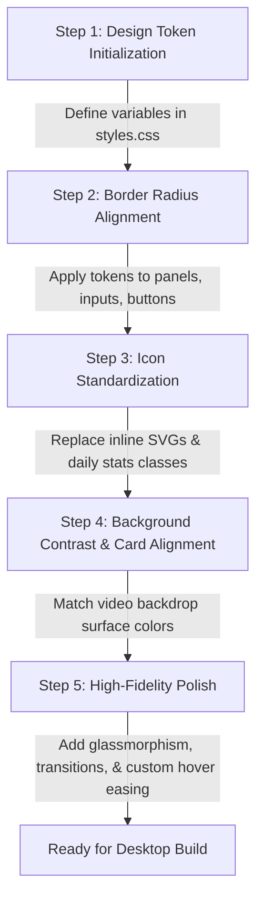

# Pomobodo — UI/UX Design Consistency & Refinement Plan

This document provides a professional design analysis of the **Pomobodo** application interface. It outlines current visual inconsistencies, details actionable technical solutions to resolve them, and recommends high-fidelity animations and aesthetic enhancements to elevate the desktop app to a premium, production-grade product.

---

## 1. Visual & System Inconsistencies (Current Issues)

### ▌ Issue A: The Icon System Mismatch
A professional interface should stick to a single icon library, visual weight, and style. Currently, Pomobodo is using a mixed approach that creates a disjointed user experience:
1. **Broken Font Icons**: In `src/index.html` (under daily stats), elements utilize class tags like `class="bi bi-alarm"` and `class="bi bi-cart"`. These icons do not load because Bootstrap Icons are not imported in the document `<head>`. Additionally, a "cart" icon has no thematic connection to a productivity/focus application.
2. **Weight & Style Inconsistency**:
   - The *Add Task* button uses a stroke SVG with a thick weight (`stroke-width="2.5"`).
   - The *Delete Task* button uses a stroke SVG with `stroke-width="2.5"`.
   - The *Restart* and *Skip* buttons use a stroke SVG with a lighter weight (`stroke-width="2"`).
   - The *Play/Pause* button transitions to a flat, solid-filled shape (`fill="currentColor"`), clashing with the outline style of surrounding controls.
3. **No Centralized Icon Styling**: Icons are scattered directly as inline SVGs in HTML and JavaScript strings without CSS classes or uniform variables, making it difficult to maintain sizes or transition timings.

### ▌ Issue B: Corner Radius & Shape Incongruity
A cohesive corner radius system builds subconscious hierarchy. Currently, Pomobodo uses hardcoded and inconsistent values that disrupt this alignment:
1. **Mismatched Radii**:
   - Main Panels (Video, Todo, Timer) use `var(--radius)` which is `14px`.
   - Mid-size elements (inputs, task items, stats panels, toast) use `var(--radius-sm)` which is `8px`.
   - Small nested elements use hardcoded values:
     - `video-num-btn` uses `6px`.
     - `mode-tab` uses `6px`.
     - `btn-delete-task` uses `4px`.
     - `.todo-checkbox` uses `4px`.
     - `.duration-field input[type="number"]` uses `4px`.
2. **Violation of Nested Radius Rules**: To prevent visual overlap and corner distortion, nested corners must follow the formula:
   $$\text{Outer Radius} = \text{Inner Radius} + \text{Padding}$$
   Currently, the margin/padding gaps of `8px` mixed with nested elements using `6px` or `8px` against an outer container of `14px` causes "cramped" corners that look misaligned to the eye.

### ▌ Issue C: Color, Panel contrast, & Glassmorphism Gaps
1. **Surface Background Discrepancy**: 
   - The entire application background (`body`) is `#000000` (pure black).
   - The Todo and Timer panels use `var(--color-surface)` (`#0B0B0B`).
   - The Video Panel background is hardcoded to `#000` (`black`).
   - *Impact*: When a video is loading, transitioning, or missing, the video panel blends directly into the page backdrop, erasing its card boundaries and making the layout look broken, while other panels stand out with `#0B0B0B` surfaces.
2. **Rigid Panels**: In a desktop app that plays high-quality ambient video backdrops, solid dark gray panels block the visual depth. The interface feels static and heavy, missing out on the organic visual texture that background videos provide.

---

## 2. Technical Solutions

To resolve these inconsistencies, the following code-level changes are proposed:

### 🛠️ Solution 1: Establish a Tokenized Border-Radius System
Replace the arbitrary corner values with a token scale in `src/styles.css` under `:root`. This enforces nested geometry rules:

```css
/* Update in src/styles.css :root */
:root {
  /* ... existing tokens ... */
  
  /* Unified Border Radius Tokens */
  --radius-lg:     16px;   /* Outer panels / main dashboard containers */
  --radius-md:     10px;   /* Medium cards, inputs, todo items, settings wrappers */
  --radius-sm:     6px;    /* Inner nested items: checkboxes, tabs, small inputs, buttons */
  --radius-xs:     4px;    /* Micro items: indicators, small delete buttons */
  --radius-full:   9999px; /* Badges, pill tabs, circular action controls */
}
```

Apply these tokens systematically:
- **`--radius-lg`**: Apply to `#video-panel`, `#todo-panel`, and `#timer-panel`.
- **`--radius-md`**: Apply to `#todo-input`, `#btn-add-task`, `.todo-item`, `#mode-tabs`, `#duration-settings`, `#timer-stats`, and `.toast`.
- **`--radius-sm`**: Apply to `.video-num-btn`, `.mode-tab`, `.todo-checkbox`, and `.duration-field input[type="number"]`.
- **`--radius-xs`**: Apply to `.btn-delete-task`.

---

### 🛠️ Solution 2: Standardize the Iconography
We will move away from arbitrary filled and broken bootstrap icons, standardizing on **Lucide-styled SVGs** with a consistent visual weight (e.g. `2px` stroke, round joins) across the entire UI.

#### 1. Replace Broken daily-stats Icons:
Remove the non-functioning Bootstrap icon classes. Since this is a minimalist status view, we can replace them with lightweight custom inline SVGs representing Focus (a Target/Check) and Break (a Coffee Cup/Pause):

```html
<!-- Proposed updated daily-stats section in src/index.html -->
<div id="daily-stats">
  <span id="daily-stats-text">
    <svg class="stats-icon" viewBox="0 0 24 24" fill="none" stroke="currentColor" stroke-width="2" stroke-linecap="round" stroke-linejoin="round">
      <circle cx="12" cy="12" r="10"></circle>
      <circle cx="12" cy="12" r="6"></circle>
      <circle cx="12" cy="12" r="2"></circle>
    </svg>
    Today: 0 work, 0 breaks
  </span>
</div>
```

#### 2. Unify SVG Stroke Weights:
Standardize all stroke-based control icons (Restart, Add Task, Delete Task, Skip) to use a unified weight:
- Add `stroke-width="2"` and `stroke-linecap="round"` to all SVGs.
- To maintain play/pause visual weight, we will use outline-based play/pause SVGs rather than filled shapes, aligning them with the rest of the outline control buttons:

```html
<!-- Unified Play/Pause Button SVG (in HTML & JS) -->
<!-- Play (Outline style) -->
<svg id="icon-play" xmlns="http://www.w3.org/2000/svg" width="20" height="20" viewBox="0 0 24 24" fill="none" stroke="currentColor" stroke-width="2" stroke-linecap="round" stroke-linejoin="round">
  <polygon points="5 3 19 12 5 21 5 3"/>
</svg>

<!-- Pause (Outline style) -->
<svg id="icon-pause" xmlns="http://www.w3.org/2000/svg" width="20" height="20" viewBox="0 0 24 24" fill="none" stroke="currentColor" stroke-width="2" stroke-linecap="round" stroke-linejoin="round" style="display:none;">
  <rect x="6" y="4" width="4" height="16"></rect>
  <rect x="14" y="4" width="4" height="16"></rect>
</svg>
```

---

### 🛠️ Solution 3: Resolve Panel backgrounds and Contours
Ensure the video panel is consistent with other cards:
1. Update `#video-panel` background in CSS to `var(--color-surface)` instead of `#000`.
2. Add a fallback loading indicator or micro-glow borders to indicate the container bounds when no video is loaded.

---

## 3. High-Fidelity UI/UX Recommendations

To elevate Pomobodo from functional to delightful, we recommend implementing the following premium UI/UX enhancements:

### 🌟 Recommendation 1: Glassmorphism & Depth (Visual Overhaul)
Rather than solid, opaque background cards, let the ambient video player serve as a background layer for the entire application, and render the panels as "frosted glass" cards overlaying it.

```css
/* Glassmorphism panel styling */
.glass-panel {
  background: rgba(11, 11, 11, 0.65) !important;
  backdrop-filter: blur(20px) saturate(160%);
  -webkit-backdrop-filter: blur(20px) saturate(160%);
  border: 1px solid rgba(255, 255, 255, 0.08) !important;
  box-shadow: 0 8px 32px 0 rgba(0, 0, 0, 0.5);
  transition: border-color var(--transition-med), box-shadow var(--transition-med);
}

.glass-panel:hover {
  border-color: rgba(255, 255, 255, 0.15) !important;
  box-shadow: 0 8px 32px 0 rgba(255, 69, 29, 0.05);
}
```

> [!NOTE]
> By applying `.glass-panel` to `#todo-panel` and `#timer-panel`, and stretching the video container to fill the *entire application background* behind the mosaic grid, the app will instantly gain an incredible three-dimensional visual depth.

---

### 🌟 Recommendation 2: Smooth Mode Transitions (Work ↔ Break)
Currently, switching between Work and Break mode triggers an immediate snap of accent colors (orange-red to teal). Adding a smooth CSS transition to the CSS custom properties will create a fluid color morphing animation:

```css
body {
  /* Allow the variables themselves to transition smoothly */
  transition: 
    background var(--transition-slow),
    color var(--transition-slow),
    --color-accent var(--transition-slow),
    --color-accent-glow var(--transition-slow);
}
```
*Note: Since standard CSS doesn't animate custom properties directly, we can define `@property` rules in CSS or transition properties that depend on them, such as borders, box-shadows, and progress SVG strokes.*

---

### 🌟 Recommendation 3: Micro-Animations & Interactions
1. **Interactive Scale Easing**: All button hovers should use a custom ease (`cubic-bezier(0.34, 1.56, 0.64, 1)` or elastic bounce) to feel tactile and snappy:
   ```css
   .ctrl-btn, #btn-add-task, .video-num-btn {
     transition: transform 0.25s cubic-bezier(0.34, 1.56, 0.64, 1), 
                 background-color var(--transition-fast), 
                 box-shadow 0.25s ease;
   }
   .ctrl-btn:hover {
     transform: scale(1.1) translateY(-1px);
   }
   ```
2. **Checkbox Morph Animation**: When checking off a task, the custom checkmark should scale and bounce into view:
   ```css
   .todo-checkbox:checked::after {
     animation: checkmark-bounce 0.2s cubic-bezier(0.34, 1.56, 0.64, 1) forwards;
   }
   @keyframes checkmark-bounce {
     from { transform: rotate(45deg) scale(0); }
     to { transform: rotate(45deg) scale(1); }
   }
   ```
3. **Smooth Accordion List Deletion**: Instead of instantly popping off the list, deleted items should fade out, slide to the right, and then smoothly animate their height to `0` so the items below them slide up cleanly:
   ```javascript
   // Recommended update in todos.js:
   function deleteTask(id) {
     const item = document.querySelector(`[data-id="${id}"]`);
     if (item) {
       item.style.transition = 'all 0.3s cubic-bezier(0.4, 0, 0.2, 1)';
       item.style.opacity = '0';
       item.style.transform = 'translateX(30px)';
       item.style.height = `${item.offsetHeight}px`; // Lock height
       
       setTimeout(() => {
         item.style.height = '0';
         item.style.padding = '0';
         item.style.margin = '0';
         item.style.border = 'none';
       }, 150);
       
       setTimeout(() => {
         tasks = tasks.filter(t => t.id !== id);
         saveTasks();
         renderList();
       }, 450);
     }
   }
   ```

---

### 🌟 Recommendation 4: Upgraded Video Selector & Ambient Blend
The number buttons `1`, `2`, `3` in the bottom-right look placeholder-like. We can upgrade them to a modern segmented slider or sub-panel:
- **Visual Pill Slider**: A horizontal pill containing small, minimalist dot indicators that expand on focus/hover (similar to standard image carousels but designed with Apple-like elegance).
- **Video Playback Control Overlay**: A tiny, elegant overlay at the top-right of the video card offering quick shortcuts (e.g., Mute/Unmute, Pause/Play backdrop, Expand to fullscreen) to make the video player feel like a premium integrated component rather than just a silent canvas element.

---

## 4. Proposed Implementation Steps

To execute this plan methodically without breaking current timers or data storage:



1. **Step 1**: Open `src/styles.css` and declare the new border radius tokens and animation ease variables under `:root`.
2. **Step 2**: Clean up the HTML structure in `src/index.html` by swapping the broken Bootstrap Icon tags for modern custom inline SVG elements.
3. **Step 3**: Re-align the class selectors in CSS to target cards, inputs, and checkboxes, ensuring they inherit the correct token variables instead of hardcoded numbers.
4. **Step 4**: Introduce the `.glass-panel` rules and restructure the HTML layers so the video elements can optionally sit behind the panels for a true glassmorphic presentation.
5. **Step 5**: Incorporate the enhanced list deletion animation in `src/todos.js` to conclude the UX transition cycle.
