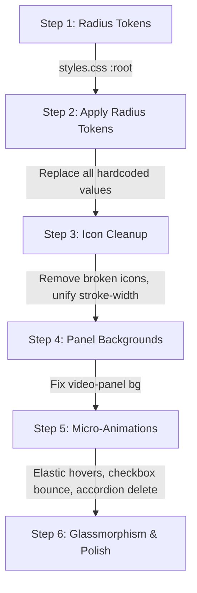

# Pomobodo — UI/UX Consistency Fix & Enhancement Plan

> **Audited from**: `src/index.html`, `src/styles.css`, `src/timer.js`, `src/todos.js`, `src/video.js`

---

## Part 1 — Current UI Issues

### 🔴 Issue 1: Broken & Misplaced Icons

**Location**: [index.html](file:///c:/Users/deter/MyProjects/BetterPomodoro/Pomobodo/src/index.html#L146-L152)

The `#daily-stats` section references **Bootstrap Icons** (`bi bi-alarm`, `bi bi-cart`) but Bootstrap Icons CSS is **never imported** in the `<head>`. These icons render as invisible empty `<i>` tags. Additionally, a "cart" icon has zero relevance to a Pomodoro app.

```html
<!-- ❌ Current — broken, thematically wrong -->
<div id="daily-stats">
  <span id="daily-stats-text">Today: 0 work, 0 breaks</span>
  <i class="bi bi-alarm"></i>
  <i class="bi bi-cart"></i>
</div>
```

---

### 🔴 Issue 2: Inconsistent Icon Style (Fill vs Stroke)

**Location**: [index.html](file:///c:/Users/deter/MyProjects/BetterPomodoro/Pomobodo/src/index.html#L119-L131)

The timer controls mix two fundamentally different icon rendering approaches:

| Button | Style | Attributes | Problem |
|--------|-------|-----------|---------|
| Restart | Stroke outline | `stroke-width="2"`, no fill | ✅ Correct |
| **Play** | **Solid fill** | `fill="currentColor"`, no stroke | ❌ Clashes |
| **Pause** | **Solid fill** | `fill="currentColor"`, no stroke | ❌ Clashes |
| Skip | Stroke outline | `stroke-width="2"`, no fill | ✅ Correct |
| Add Task | Stroke outline | `stroke-width="2.5"` | ⚠️ Weight mismatch |
| Delete Task | Stroke outline | `stroke-width="2.5"` | ⚠️ Weight mismatch |

The Play/Pause icons use `fill="currentColor"` (solid shapes) while every other icon uses `stroke` outlines. The Add Task and Delete Task icons use `stroke-width="2.5"` while timer controls use `stroke-width="2"`.

---

### 🔴 Issue 3: Fragmented Border Radius Values

**Location**: [styles.css](file:///c:/Users/deter/MyProjects/BetterPomodoro/Pomobodo/src/styles.css#L42-L44)

Only two radius tokens exist (`--radius: 14px` and `--radius-sm: 8px`), but **five different hardcoded values** are scattered through the CSS:

| Element | Current Value | Source |
|---------|--------------|--------|
| Main panels | `var(--radius)` = 14px | Token ✅ |
| Inputs, todo items, stats | `var(--radius-sm)` = 8px | Token ✅ |
| `.video-num-btn` | `6px` hardcoded | ❌ |
| `.mode-tab` | `6px` hardcoded | ❌ |
| `.btn-delete-task` | `4px` hardcoded | ❌ |
| `.todo-checkbox` | `4px` hardcoded | ❌ |
| `.duration-field input` | `4px` hardcoded | ❌ |
| `.badge` | `99px` hardcoded | ❌ |

This also violates the **nested radius rule** (`outer_radius = inner_radius + padding`), causing corners that look visually cramped when a 6px-radius child sits inside a 14px-radius parent with only 8px padding.

---

### 🔴 Issue 4: Video Panel Background Mismatch

**Location**: [styles.css](file:///c:/Users/deter/MyProjects/BetterPomodoro/Pomobodo/src/styles.css#L143-L150)

```css
/* ❌ Hardcoded black — blends into body when video isn't loaded */
#video-panel { background: #000; }
```

- Body background: `#000000`
- Todo & Timer panels: `var(--color-surface)` → `#0B0B0B`
- Video panel: hardcoded `#000`

When the video is loading or missing, the video panel **disappears into the body background**, losing its card boundary. Other panels remain visible at `#0B0B0B`.

---

### 🟡 Issue 5: No Icon Size Standardization

Icons across the app use arbitrary `width`/`height` values:
- Timer controls: `18px` (Restart, Skip) vs `22px` (Play/Pause)
- Add task: `16px`
- Delete task: `12px`

No CSS class governs icon sizing — every SVG is manually sized inline.

---

## Part 2 — Technical Solutions

### ✅ Fix 1: Remove Broken Icons from Daily Stats

Replace the broken Bootstrap `<i>` tags with a single clean inline SVG or remove them entirely:

```html
<!-- ✅ Fixed — clean, no broken dependencies -->
<div id="daily-stats">
  <svg class="daily-icon" viewBox="0 0 24 24" width="14" height="14"
       fill="none" stroke="currentColor" stroke-width="2"
       stroke-linecap="round" stroke-linejoin="round">
    <circle cx="12" cy="12" r="10"/>
    <circle cx="12" cy="12" r="6"/>
    <circle cx="12" cy="12" r="2"/>
  </svg>
  <span id="daily-stats-text">Today: 0 work, 0 breaks</span>
</div>
```

**Files**: `src/index.html` (lines 146–152)

---

### ✅ Fix 2: Unify All Icons to Stroke-Only, Weight 2

Convert Play/Pause from solid fill to stroke outlines. Normalize all SVGs to `stroke-width="2"`:

```html
<!-- ✅ Play — stroke outline -->
<svg id="icon-play" width="20" height="20" viewBox="0 0 24 24"
     fill="none" stroke="currentColor" stroke-width="2"
     stroke-linecap="round" stroke-linejoin="round">
  <polygon points="5 3 19 12 5 21 5 3"/>
</svg>

<!-- ✅ Pause — stroke outline -->
<svg id="icon-pause" width="20" height="20" viewBox="0 0 24 24"
     fill="none" stroke="currentColor" stroke-width="2"
     stroke-linecap="round" stroke-linejoin="round" style="display:none;">
  <rect x="6" y="4" width="4" height="16"/>
  <rect x="14" y="4" width="4" height="16"/>
</svg>
```

Also update Add Task (`stroke-width="2.5"` → `"2"`) and Delete Task (`stroke-width="2.5"` → `"2"`).

**Files**: `src/index.html` (lines 63, 122–130), `src/todos.js` (lines 132–135)

---

### ✅ Fix 3: Tokenize the Border Radius System

Replace the two-token system with a four-tier scale:

```css
:root {
  --radius-lg:   16px;  /* Outer panels: video, todo, timer */
  --radius-md:   10px;  /* Mid elements: inputs, items, stats, tabs wrapper */
  --radius-sm:    6px;  /* Inner: video btns, mode tabs, checkboxes, small inputs */
  --radius-xs:    4px;  /* Micro: delete buttons, indicators */
  --radius-full: 9999px; /* Pills: badges */
}
```

Then apply tokens to **every hardcoded value** as mapped in Issue 3.

**Files**: `src/styles.css`

---

### ✅ Fix 4: Fix Video Panel Background

```css
/* ✅ Match other panels — visible even without video */
#video-panel {
  background: var(--color-surface);
}
```

**Files**: `src/styles.css` (line 147)

---

### ✅ Fix 5: Add Icon Size Utility Classes

```css
.icon-sm  { width: 14px; height: 14px; }
.icon-md  { width: 18px; height: 18px; }
.icon-lg  { width: 20px; height: 20px; }
```

Apply `.icon-md` to Restart/Skip, `.icon-lg` to Play/Pause, `.icon-sm` to Add/Delete Task.

**Files**: `src/styles.css`, `src/index.html`, `src/todos.js`

---

## Part 3 — Enhancement Recommendations

### 🌟 1. Glassmorphism Depth

Make the ambient video the full-window background and render Todo + Timer as frosted glass overlays:

```css
.glass-panel {
  background: rgba(11, 11, 11, 0.65);
  backdrop-filter: blur(20px) saturate(160%);
  -webkit-backdrop-filter: blur(20px) saturate(160%);
  border: 1px solid rgba(255, 255, 255, 0.08);
  box-shadow: 0 8px 32px rgba(0, 0, 0, 0.5);
}

.glass-panel:hover {
  border-color: rgba(255, 255, 255, 0.15);
}
```

> [!TIP]
> This would require restructuring the layout so the `<video>` element sits behind the grid as a fixed background layer, with Todo and Timer panels floating above it as glass cards.

---

### 🌟 2. Smooth Work ↔ Break Color Transitions

Use CSS `@property` to make custom property transitions animatable:

```css
@property --color-accent {
  syntax: '<color>';
  inherits: true;
  initial-value: #FF451D;
}

body {
  transition: --color-accent 600ms ease;
}
```

This turns the instant orange→teal snap into a smooth color morph across the ring, buttons, and glows.

---

### 🌟 3. Elastic Micro-Animations

**Bouncy button hovers** — replace the current linear `scale(1.06)` with an elastic overshoot curve:

```css
.ctrl-btn, #btn-add-task, .video-num-btn {
  transition: transform 0.25s cubic-bezier(0.34, 1.56, 0.64, 1),
              background var(--transition-fast),
              box-shadow 0.25s ease;
}
```

**Checkbox bounce** — animate the checkmark scaling in:

```css
.todo-checkbox:checked::after {
  animation: check-bounce 0.2s cubic-bezier(0.34, 1.56, 0.64, 1) forwards;
}
@keyframes check-bounce {
  from { transform: rotate(45deg) scale(0); }
  to   { transform: rotate(45deg) scale(1); }
}
```

---

### 🌟 4. Accordion Task Deletion

Instead of a basic fade-out, collapse the deleted item's height for a smooth list reflow:

```javascript
function deleteTask(id) {
  const item = document.querySelector(`[data-id="${id}"]`);
  if (item) {
    item.style.height = `${item.offsetHeight}px`;
    item.style.transition = 'all 0.3s cubic-bezier(0.4, 0, 0.2, 1)';
    item.style.opacity = '0';
    item.style.transform = 'translateX(30px)';
    setTimeout(() => {
      item.style.height = '0';
      item.style.padding = '0';
      item.style.margin = '0';
    }, 150);
    setTimeout(() => { /* remove from DOM */ }, 450);
  }
}
```

---

### 🌟 5. Enhanced Video Selector

Replace the plain numbered buttons (`1`, `2`, `3`) with a **dot-carousel indicator** or mini thumbnail strip:
- Small circular dots that expand on hover
- Active dot uses the accent color with a glow ring
- Optional: show the video name as a tooltip on hover

---

### 🌟 6. Timer Ring Glow Pulse

Add a subtle pulsing glow behind the progress ring while the timer is running:

```css
#timer-panel.running #ring-progress {
  animation: ring-glow 2s ease-in-out infinite;
}
@keyframes ring-glow {
  0%, 100% { filter: drop-shadow(0 0 8px var(--color-accent-glow)); }
  50%      { filter: drop-shadow(0 0 16px var(--color-accent-glow)); }
}
```

---

## Part 4 — Implementation Order



| Step | Files Touched | Risk |
|------|--------------|------|
| 1–2: Radius tokens | `styles.css` | Low — CSS-only |
| 3: Icon cleanup | `index.html`, `todos.js` | Low — visual only |
| 4: Panel backgrounds | `styles.css` | Low — CSS-only |
| 5: Animations | `styles.css`, `todos.js` | Medium — behavior change |
| 6: Glassmorphism | `index.html`, `styles.css` | High — layout restructure |
