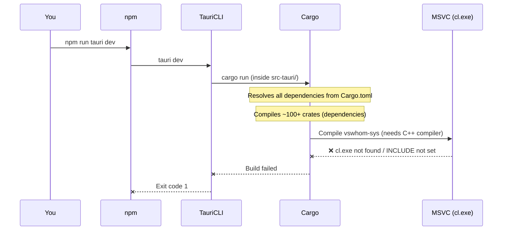

# Why the Tauri Build Is Failing — Full Explanation

## The Short Answer

Your app **built successfully on June 8** and the compiled binary (`pomobodo-tauri.exe`) was cached in the `target/debug/` folder. On subsequent runs, Cargo (the Rust build system) reused those cached artifacts and **skipped recompiling** the problematic dependency. Now, something triggered a **full recompile** (likely a dependency change, a `cargo clean`, or Cargo invalidating its cache), and the `vswhom-sys` crate needs to compile a C++ file from scratch — but it can't find the C++ compiler in your current terminal session.

---

## Your Project's Technology Stack

Tauri is a **two-stack framework**. Your single app is actually built from two completely separate technology worlds that talk to each other:

```
┌─────────────────────────────────────────────┐
│            Your Tauri Application            │
│                                              │
│  ┌──────────────┐    ┌────────────────────┐  │
│  │   Frontend    │◄──►│     Backend        │  │
│  │  (Web Stack)  │    │   (Rust Stack)     │  │
│  │              │    │                    │  │
│  │  HTML/CSS/JS  │    │  main.rs, lib.rs   │  │
│  │  src/         │    │  src-tauri/src/    │  │
│  │  npm manages  │    │  Cargo manages     │  │
│  └──────────────┘    └────────────────────┘  │
└─────────────────────────────────────────────┘
```

| Term | What It Is |
|------|-----------|
| **npm** | Node Package Manager — downloads and manages JavaScript libraries. Defined in `package.json`. |
| **Cargo** | Rust's package manager and build system — downloads and compiles Rust libraries ("crates"). Defined in `Cargo.toml`. |
| **Crate** | A Rust library or package (like an npm package but for Rust). |
| **Rust** | A compiled systems programming language. Your backend code is written in Rust. |
| **MSVC** | Microsoft Visual C++ — Microsoft's C/C++ compiler toolchain. Rust on Windows uses this to link and compile native code. |
| **Tauri** | The framework that glues the web frontend to the Rust backend, creating a native desktop window to display your HTML/CSS/JS. |

---

## What Each File Does

### Frontend Side (managed by npm)

| File | Purpose |
|------|---------|
| [package.json](file:///c:/Users/deter/MyProjects/BetterPomodoro/Pomobodo-Tauri/package.json) | Defines your npm project. Contains one script (`tauri`) and one dependency (`@tauri-apps/cli`). When you run `npm run tauri dev`, npm calls the Tauri CLI. |
| [src/index.html](file:///c:/Users/deter/MyProjects/BetterPomodoro/Pomobodo-Tauri/src/index.html) | Your app's UI — standard HTML/CSS/JS. Tauri renders this inside a native window (using the OS's built-in web renderer, like Edge WebView2 on Windows). |

### Backend Side (managed by Cargo — **this is what uses the Rust toolchain**)

| File | Purpose |
|------|---------|
| [Cargo.toml](file:///c:/Users/deter/MyProjects/BetterPomodoro/Pomobodo-Tauri/src-tauri/Cargo.toml) | The Rust project manifest. Lists dependencies (`tauri`, `serde`, etc.) and build settings. Equivalent to `package.json` for Rust. |
| `Cargo.lock` | Locks exact dependency versions (like `package-lock.json`). |
| [build.rs](file:///c:/Users/deter/MyProjects/BetterPomodoro/Pomobodo-Tauri/src-tauri/build.rs) | A **build script** that runs *before* your Rust code compiles. It calls `tauri_build::build()` which generates glue code Tauri needs. |
| [main.rs](file:///c:/Users/deter/MyProjects/BetterPomodoro/Pomobodo-Tauri/src-tauri/src/main.rs) | The entry point of your Rust binary. It just calls `pomobodo_tauri_lib::run()`. |
| [lib.rs](file:///c:/Users/deter/MyProjects/BetterPomodoro/Pomobodo-Tauri/src-tauri/src/lib.rs) | The main library. Sets up the Tauri app builder, registers plugins, and defines commands (like `greet`) that your frontend JS can call. |
| [tauri.conf.json](file:///c:/Users/deter/MyProjects/BetterPomodoro/Pomobodo-Tauri/src-tauri/tauri.conf.json) | Tauri's configuration — window size, title, security policies, where the frontend files are (`"frontendDist": "../src"`). |

---

## What Happens When You Run `npm run tauri dev`



---

## Why It Worked Before (Boilerplate / Previous Build)

When you first created the project and ran `npm run tauri dev` successfully (on **June 8th, 1:47 PM**), Cargo compiled **everything** — including `vswhom-sys` — and cached the results in `src-tauri/target/debug/`.

On subsequent runs, Cargo's incremental compilation checks:
> "Has anything changed since the last build? No? Then reuse the cached `.o` files and the compiled binary."

So even if your environment was slightly different between sessions, **the cached build artifacts meant `vswhom-sys` was never recompiled**. It just reused the old compiled output.

### What Changed Now

The build log shows `Compiling vswhom-sys v0.1.3` — meaning Cargo decided this crate needs a **fresh recompile**. This happens when:

1. **`cargo clean` was run** — wipes all cached build artifacts
2. **A dependency version changed** — updating `Cargo.lock` or `Cargo.toml` can invalidate the cache
3. **Rust toolchain was updated** — forces recompilation of all crates
4. **The `target/` directory was partially deleted or corrupted**

---

## The Actual Error — Explained

The build output reveals the root cause clearly:

```
VCINSTALLDIR = None          ← Doesn't know where Visual Studio is installed
VCToolsVersion = None        ← Doesn't know which C++ compiler version to use
WindowsSdkDir = None         ← Doesn't know where the Windows SDK headers are
WindowsSDKVersion = None     ← Doesn't know which SDK version to use
INCLUDE = None               ← Doesn't know where C++ header files are
LIB = None                   ← Doesn't know where C++ library files are
CXX = None                   ← No C++ compiler path specified
```

All of these environment variables are **None**. The `vswhom-sys` crate uses the `cc` crate (a Rust build helper) to compile `ext/vswhom.cpp`. The `cc` crate tries to locate `cl.exe` (the MSVC C++ compiler) using these environment variables — but they're all empty.

### Why Are They Empty?

These variables are normally set by running **"Developer Command Prompt for Visual Studio"** or by calling `vcvarsall.bat`. A normal PowerShell/CMD window does **not** have them set.

Your system has:
- ✅ **Visual Studio 2019 Build Tools** — with C++ workload and `cl.exe` installed
- ✅ **Visual Studio Community 2026** — but **without** the C++ workload
- ❌ None of these tools are on your `PATH` or have their environment variables set in your current terminal

> [!IMPORTANT]
> The `cc` crate (used by `vswhom-sys`) normally auto-detects Visual Studio installations via `vswhere.exe`. The fact that it's failing suggests either the 2026 Community install is being detected first (and it has no C++ tools), or the detection is failing altogether.

---

## The Solution

### Option 1: Open "Developer PowerShell for VS 2019" (Quick Fix)

This opens a terminal with all the MSVC environment variables pre-configured:

1. Press **Win** key, search for **"Developer PowerShell for VS 2019"**
2. `cd` to your project: `cd C:\Users\deter\MyProjects\BetterPomodoro\Pomobodo-Tauri`
3. Run: `npm run tauri dev`

### Option 2: Add C++ Workload to Visual Studio 2026 (Permanent Fix)

Since you have VS Community 2026 installed (likely for your ASP.NET e-commerce project), add the C++ tools to it:

1. Open **Visual Studio Installer**
2. Find **Visual Studio Community 2026** → click **Modify**
3. Check **"Desktop development with C++"**
4. Click **Modify** and wait for installation
5. Restart your terminal and run `npm run tauri dev`

This is the recommended fix because the `cc` crate will then auto-detect the latest VS installation with C++ tools.

### Option 3: Set Environment Variables Manually (One-Time per Terminal)

Run this in PowerShell before building:

```powershell
cmd /c '"C:\Program Files (x86)\Microsoft Visual Studio\2019\BuildTools\VC\Auxiliary\Build\vcvarsall.bat" x64 && set' | ForEach-Object { if ($_ -match "^(.+?)=(.*)$") { [System.Environment]::SetEnvironmentVariable($matches[1], $matches[2]) } }
```

Then run `npm run tauri dev` in the same terminal session.
