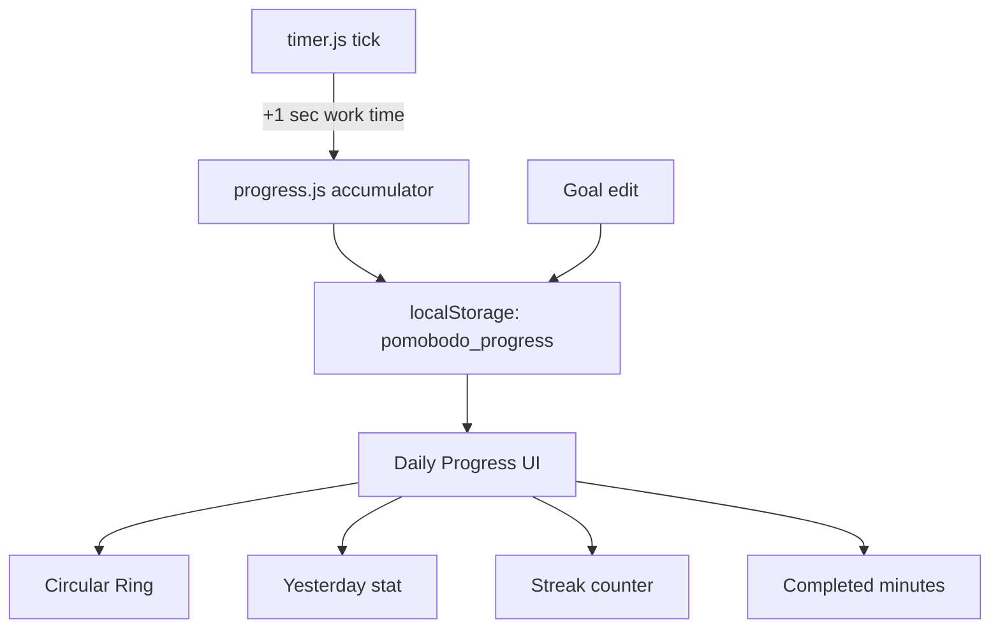

# Daily Progress Widget — Implementation Plan

## Overview

Replace the existing session-count stats section in the timer panel with a **time-based Daily Progress widget** featuring a circular progress ring, daily goal, yesterday comparison, and streak counter.

---

## Architecture Summary



---

## Phase 1 — Data Model & Storage

### What changes

| Current (`pomobodo_stats`) | New (`pomobodo_progress`) |
|---|---|
| `workCount` (all-time sessions) | **Removed** |
| `breakCount` (all-time sessions) | **Removed** |
| `todayWork` (session count) | `todayMinutes` (float, accumulated work minutes) |
| `todayBreaks` (session count) | **Removed** |
| `todayDate` (string) | `todayDate` (string) — kept |
| — | `yesterdayMinutes` (float) |
| — | `streak` (integer, days) |
| — | `goalHours` (integer, default 1) |
| — | `goalMinutes` (integer, default 0) |

> [!IMPORTANT]
> The old `pomobodo_stats` key will be **kept readable** for one migration cycle, then ignored. New data writes to `pomobodo_progress`.

### New storage schema (`pomobodo_progress`)
```json
{
  "todayMinutes": 10.5,
  "todayDate": "Tue Jun 24 2026",
  "yesterdayMinutes": 0,
  "streak": 0,
  "goalHours": 1,
  "goalMinutes": 0
}
```

### Daily reset logic (runs on every `render()` call)
1. Compare `todayDate` to `new Date().toDateString()`
2. If different day:
   - Copy `todayMinutes` → `yesterdayMinutes`
   - Check if `todayMinutes >= goalTotalMinutes` → if yes, `streak++`; else `streak = 0`
   - Reset `todayMinutes = 0`
   - Update `todayDate`
   - Save

### Partial session tracking
- On **every tick** (1 second) while in `work` mode, increment a seconds accumulator
- The rendered "Completed" value = `Math.floor(accumulatedSeconds / 60)` minutes
- Save to localStorage on pause, skip, complete, and periodically (every 30s while running) to survive crashes

---

## Phase 2 — New Module: `progress.js`

### File: [src/progress.js](file:///c:/Users/deter/MyProjects/BetterPomodoro/Pomobodo/src/progress.js) *(new)*

**Responsibilities:**
1. Load/save `pomobodo_progress` from localStorage
2. Expose `addWorkSecond()` — called by timer.js on each work-mode tick
3. Expose `getProgressData()` — returns current state for rendering
4. Expose `setGoal(hours, minutes)` — updates the daily goal
5. Expose `initProgress()` — loads data, runs daily reset check
6. Render the Daily Progress widget DOM

### Exported API

```js
export function initProgress()          // Load data, daily reset, initial render
export function addWorkSecond()         // +1s to today's accumulator, re-render
export function getProgressData()       // { todayMinutes, yesterdayMinutes, streak, goalHours, goalMinutes, goalTotalMinutes }
export function setGoal(hours, minutes) // Update goal, save, re-render
```

---

## Phase 3 — Timer Integration

### File: [src/timer.js](file:///c:/Users/deter/MyProjects/BetterPomodoro/Pomobodo/src/timer.js)

### Changes

1. **Remove** session-count fields from `state`: `workCount`, `breakCount`, `todayWork`, `todayBreaks`
2. **Remove** `saveStats()` / `loadStats()` functions (replaced by progress.js)
3. **Remove** stat DOM refs: `elStatWork`, `elStatBreaks`, `elDailyStats`
4. **Remove** stat rendering from `render()`: lines updating `elStatWork`, `elStatBreaks`, `elDailyStats`
5. **Add** import: `import { addWorkSecond } from './progress.js'`
6. **Modify** `tick()`:
   ```diff
    function tick() {
      if (state.timeRemaining <= 0) {
        handleComplete();
        return;
      }
      state.timeRemaining--;
   +  if (state.mode === 'work') {
   +    addWorkSecond();
   +  }
      render();
    }
   ```
7. **Modify** `handleComplete()` — remove session counter increments, keep sound/notification/advance logic

---

## Phase 4 — HTML Changes

### File: [src/index.html](file:///c:/Users/deter/MyProjects/BetterPomodoro/Pomobodo/src/index.html)

### Replace the existing stats section (lines 165–184) with:

```html
<!-- Daily Progress Widget -->
<div id="daily-progress" aria-label="Daily Progress">
  <div id="progress-header">
    <span id="progress-title">Daily progress</span>
    <button id="btn-edit-goal" aria-label="Edit daily goal" title="Edit goal">
      <!-- Pencil SVG icon -->
    </button>
  </div>

  <div id="progress-body">
    <!-- Left: Yesterday -->
    <div class="progress-stat" id="stat-yesterday">
      <span class="progress-stat-label">Yesterday</span>
      <span class="progress-stat-value" id="yesterday-value">0</span>
      <span class="progress-stat-unit">minutes</span>
    </div>

    <!-- Center: Circular ring + goal -->
    <div id="progress-ring-container">
      <svg id="progress-ring-svg" viewBox="0 0 120 120">
        <circle id="progress-ring-track" cx="60" cy="60" r="52" />
        <circle id="progress-ring-fill" cx="60" cy="60" r="52" />
      </svg>
      <div id="progress-ring-inner">
        <span id="progress-goal-label">Daily goal</span>
        <span id="progress-goal-value">1</span>
        <span id="progress-goal-unit">hour</span>
      </div>
    </div>

    <!-- Right: Streak -->
    <div class="progress-stat" id="stat-streak">
      <span class="progress-stat-label">Streak</span>
      <span class="progress-stat-value" id="streak-value">0</span>
      <span class="progress-stat-unit">days</span>
    </div>
  </div>

  <!-- Completed summary -->
  <div id="progress-completed">
    Completed: <span id="completed-minutes">0</span> minutes
  </div>
</div>

<!-- Goal edit inline (hidden by default, reuses duration-settings style) -->
<div id="goal-editor" class="hidden">
  <div class="duration-field">
    <label for="input-goal-hours">Hours</label>
    <input type="number" id="input-goal-hours" value="1" min="0" max="23" />
  </div>
  <div class="duration-divider"></div>
  <div class="duration-field">
    <label for="input-goal-minutes">Min</label>
    <input type="number" id="input-goal-minutes" value="0" min="0" max="59" />
  </div>
</div>
```

> [!NOTE]
> The goal editor reuses the existing `duration-settings` styling pattern (same `duration-field` class, same input styles). Clicking the pencil icon toggles `#goal-editor` visibility.

---

## Phase 5 — CSS for Daily Progress Widget

### File: [src/styles.css](file:///c:/Users/deter/MyProjects/BetterPomodoro/Pomobodo/src/styles.css)

### Remove
- `#timer-stats`, `.stat-item`, `.stat-value`, `.stat-label`, `.stat-divider` styles (lines 1082–1122)
- `#daily-stats`, `.daily-icon`, `#daily-stats-text` styles (lines 1124–1147)

### Add (new section: `DAILY PROGRESS WIDGET`)

Key design tokens from the reference image:
- Widget background: `var(--color-surface-2)` (dark card)
- Ring track: `var(--color-surface-3)`
- Ring fill: `var(--color-break)` (#34D399, teal-green — matches the reference image)
- Text hierarchy: primary for values, muted for labels/units
- Max-width: `220px` (matches existing timer panel element widths)

Progress ring specifics:
- SVG circle radius: 52, circumference: `2π × 52 ≈ 326.7`
- `stroke-dasharray: 326.7` / `stroke-dashoffset` animated based on % complete
- Ring always uses teal-green regardless of work/break mode (it's a daily aggregate)

---

## Phase 6 — Main.js Integration

### File: [src/main.js](file:///c:/Users/deter/MyProjects/BetterPomodoro/Pomobodo/src/main.js)

```diff
 import { initTimer, timerEvents } from './timer.js';
 import { initTodos } from './todos.js';
 import { initVideo, playVideo, pauseVideo } from './video.js';
+import { initProgress } from './progress.js';

 window.addEventListener('DOMContentLoaded', async () => {
   initTimer();
   initTodos();
+  initProgress();
   await initVideo();
   // ... rest unchanged
 });
```

---

## Execution Order

| Step | File(s) | Description |
|------|---------|-------------|
| 1 | `progress.js` | Create new module with data model, localStorage, goal logic |
| 2 | `index.html` | Replace stats HTML with daily progress widget markup |
| 3 | `styles.css` | Remove old stat styles, add daily progress widget styles |
| 4 | `timer.js` | Strip session-count logic, wire `addWorkSecond()` into tick |
| 5 | `main.js` | Import and init progress module |
| 6 | **Test** | Run app, verify ring fills, goal edit, streak, yesterday, midnight reset |

---

## Edge Cases to Handle

| Scenario | Behavior |
|----------|----------|
| Goal set to 0h 0m | Treat as 1 minute minimum (prevent division by zero) |
| Progress exceeds goal | Ring fills to 100%, "Completed" keeps counting |
| App opened after multi-day gap | `yesterdayMinutes` shows the *last active day* (not literal yesterday) |
| Midnight rolls over while timer running | Daily reset triggers on next `render()` call |
| First-time user (no localStorage) | All zeros, goal = 1 hour, streak = 0 |
