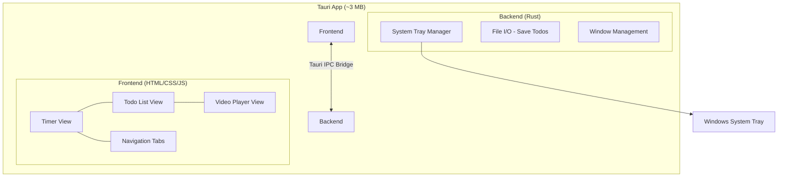

# Pomobodo — Tauri Implementation Plan

## Architecture Overview



> **Tauri IPC Bridge**: A secure messaging channel that lets your JavaScript frontend talk to your Rust backend. Think of it like an API between the two layers — JS calls a function, Rust executes it and returns the result.

---

## Phase 0: Environment Setup

### Goal
Install all prerequisite tools needed to build a Tauri app.

### Key Terms
| Term | What It Is |
|------|-----------|
| **Rust** | A systems programming language. Tauri's backend is written in Rust. You won't write much of it — mostly config. |
| **Cargo** | Rust's package manager and build tool (like `npm` for JavaScript, or `NuGet` for C#). |
| **Node.js** | A JavaScript runtime. Used to run the build tools that bundle your frontend code. |
| **npm** | Node.js's package manager. Used to install frontend dependencies. |
| **WebView2** | Microsoft's browser engine (based on Edge/Chromium) that Tauri uses to render your HTML/CSS/JS. Pre-installed on Windows 10/11. |

### Steps

**Step 0.1 — Install Rust**
1. Go to [https://rustup.rs](https://rustup.rs)
2. Download and run `rustup-init.exe`
3. Accept all defaults (it installs Rust + Cargo)
4. Close and reopen your terminal after installation

**Step 0.2 — Install Node.js**
1. Go to [https://nodejs.org](https://nodejs.org)
2. Download the **LTS** version (not Current)
3. Run the installer, accept defaults

**Step 0.3 — Install Visual Studio Build Tools**
Rust on Windows needs the MSVC C++ build tools.
1. Download "Build Tools for Visual Studio 2022" from [https://visualstudio.microsoft.com/visual-cpp-build-tools/](https://visualstudio.microsoft.com/visual-cpp-build-tools/)
2. In the installer, check **"Desktop development with C++"**
3. Install (this is ~2-6 GB)

> [!NOTE]
> If you already have Visual Studio installed with C++ workloads (which you likely do from your e-commerce project), you can skip Step 0.3.

### ✅ Phase 0 Verification

| Check | Command | Expected Result |
|-------|---------|-----------------|
| Rust installed | `rustc --version` | `rustc 1.x.x` |
| Cargo installed | `cargo --version` | `cargo 1.x.x` |
| Node.js installed | `node --version` | `v20.x.x` or higher |
| npm installed | `npm --version` | `10.x.x` or higher |

Run all four commands in a **new** terminal. If any fail, reinstall that tool.

---

## Phase 1: Scaffold the Tauri Project

### Goal
Create the initial project structure with all config files and a "Hello World" window.

### Key Terms
| Term | What It Is |
|------|-----------|
| **Scaffold** | Auto-generating a starter project with the correct folder structure and config files. |
| **Vite** | A fast frontend build tool that serves your HTML/CSS/JS during development with hot-reload (changes appear instantly without restarting). |
| **`tauri.conf.json`** | The main config file for your Tauri app — controls window size, title, system tray, permissions, etc. |

### Steps

**Step 1.1 — Create the project**
```powershell
cd C:\Users\deter\MyProjects\Pomobodo
npm create tauri-app@latest ./Pomobodo-Tauri -- --template vanilla --manager npm
```

> **`--template vanilla`** means plain HTML/CSS/JS — no React, Vue, or other framework. Keeps it simple.

**Step 1.2 — Install dependencies**
```powershell
cd C:\Users\deter\MyProjects\Pomobodo\Pomobodo-Tauri
npm install
```

**Step 1.3 — Understand the project structure**
```
Pomobodo-Tauri/
├── src/                    # Your frontend code (HTML/CSS/JS)
│   ├── index.html          # Main HTML file
│   ├── main.js             # Entry JS file
│   └── style.css           # Global styles
├── src-tauri/              # Rust backend code
│   ├── src/
│   │   └── main.rs         # Rust entry point
│   ├── Cargo.toml          # Rust dependencies (like package.json)
│   ├── tauri.conf.json     # Tauri app configuration
│   └── icons/              # App icons
├── package.json            # Node.js dependencies
└── vite.config.js          # Vite build config
```

**Step 1.4 — First run**
```powershell
npm run tauri dev
```

> This starts **two things**: Vite serves your frontend on localhost, and Tauri opens a native window pointing to it. First run is slow (~2-5 min) because Rust compiles everything. Subsequent runs are fast (~5-10 sec).

### ✅ Phase 1 Verification

| Check | How | Expected Result |
|-------|-----|-----------------|
| Project created | Folder `Pomobodo-Tauri` exists with `src/` and `src-tauri/` | ✅ |
| Dependencies installed | `node_modules/` folder exists | ✅ |
| App launches | Run `npm run tauri dev` | A native window opens showing the Tauri starter page |
| Hot reload works | Edit text in `src/index.html`, save | Window updates without restarting |

---

## Phase 2: Build the Timer View

### Goal
Create a functional Pomodoro countdown timer with start/pause/reset controls.

### Key Terms
| Term | What It Is |
|------|-----------|
| **`setInterval`** | A JavaScript function that runs a callback repeatedly at a fixed interval (e.g., every 1000ms = 1 second). Used for the countdown tick. |
| **CSS Custom Properties** | Variables in CSS (e.g., `--primary-color: #ff6347`) that let you define a value once and reuse it everywhere. |

### Steps

**Step 2.1 — Set up the HTML skeleton**

Replace `src/index.html` with a three-tab layout structure:
```html
<!-- Navigation bar with 3 tabs: Timer | Todos | Videos -->
<!-- Content area that swaps based on active tab -->
<!-- Timer view: countdown display + control buttons -->
```

**Step 2.2 — Create the CSS design system**

In `src/style.css`, define:
- Dark theme color palette using CSS Custom Properties
- Tab navigation styling
- Timer display (large centered countdown text)
- Circular progress indicator using SVG or `conic-gradient`
- Button styles for Start / Pause / Reset
- Smooth transitions between views

**Step 2.3 — Implement timer logic**

In a new file `src/timer.js`:
- State variables: `timeRemaining`, `isRunning`, `currentMode` (work/break)
- `startTimer()` — begins `setInterval` decrementing every second
- `pauseTimer()` — clears the interval
- `resetTimer()` — resets to 25:00 (work) or 5:00 (break)
- `switchMode()` — toggles between work and break periods
- Update the DOM every tick with the formatted time (`MM:SS`)

**Step 2.4 — Configure Pomodoro defaults**
- Work session: **25 minutes**
- Short break: **5 minutes**
- Long break (every 4 sessions): **15 minutes**
- Auto-switch between work → break

### ✅ Phase 2 Verification

| Check | How | Expected Result |
|-------|-----|-----------------|
| Timer displays `25:00` | Launch app | Countdown shows `25:00` |
| Start works | Click Start | Timer counts down each second |
| Pause works | Click Pause mid-countdown | Timer freezes, resumes on re-click |
| Reset works | Click Reset | Timer resets to `25:00` |
| Break mode | Let timer hit `00:00` | Switches to `05:00` break mode |
| Visual feedback | Observe during countdown | Progress indicator animates smoothly |

---

## Phase 3: Build the Todo List View

### Goal
A simple task list where users can add, check off, and delete tasks.

### Key Terms
| Term | What It Is |
|------|-----------|
| **`localStorage`** | A browser API that saves key-value data persistently on the user's machine. Data survives app restarts. Tauri's WebView supports this. |
| **DOM manipulation** | Using JavaScript to create, modify, or remove HTML elements dynamically (e.g., adding a new `<li>` when the user types a task). |

### Steps

**Step 3.1 — Build the todo HTML structure**
- Text input + "Add" button at the top
- Scrollable list of tasks below
- Each task has: checkbox, text label, delete button

**Step 3.2 — Implement todo logic**

In a new file `src/todos.js`:
- `addTask(text)` — creates a task object `{ id, text, completed }`, appends to array, re-renders list
- `toggleTask(id)` — flips `completed` boolean
- `deleteTask(id)` — removes from array
- `saveTasks()` — writes array to `localStorage`
- `loadTasks()` — reads from `localStorage` on startup

**Step 3.3 — Style the todo list**
- Clean input field with rounded corners
- Task items with hover effects
- Strikethrough + fade for completed tasks
- Subtle delete button that appears on hover
- Smooth add/remove animations using CSS transitions

### ✅ Phase 3 Verification

| Check | How | Expected Result |
|-------|-----|-----------------|
| Add task | Type text, click Add or press Enter | Task appears in list |
| Complete task | Click checkbox | Text gets strikethrough styling |
| Delete task | Click delete button | Task removed with animation |
| Persistence | Add tasks → close app → reopen | Tasks are still there |
| Empty state | Delete all tasks | Friendly "No tasks yet" message shown |

---

## Phase 4: Build the Video Player View

### Goal
An embedded video player that can play local video files or YouTube-style URLs.

### Key Terms
| Term | What It Is |
|------|-----------|
| **HTML5 `<video>`** | A native HTML element for playing video files. Supports MP4, WebM, and OGG formats without any plugins. |
| **`<iframe>`** | An HTML element that embeds another webpage inside your page. Used to embed YouTube/Vimeo players. |
| **CSP (Content Security Policy)** | A security setting in Tauri that controls which external URLs your app can load. You'll need to allow YouTube's embed domain. |

### Steps

**Step 4.1 — Build video player HTML**
- A URL/file input bar at the top
- Large video display area (fills remaining space)
- Toggle between local file mode and URL embed mode

**Step 4.2 — Implement local file playback**
- "Open File" button triggers a file picker
- Use Tauri's `dialog.open()` API to select a video file
- Convert the file path to a Tauri `asset:` protocol URL
- Set as the `<video>` element's `src`

**Step 4.3 — Implement URL embed playback**
- Text input for pasting a YouTube/Vimeo URL
- Parse the URL to extract the video ID
- Render an `<iframe>` pointing to the embed URL (e.g., `https://youtube.com/embed/VIDEO_ID`)

**Step 4.4 — Update Tauri security config**

In `src-tauri/tauri.conf.json`, update the CSP to allow YouTube embeds:
```json
"security": {
  "csp": "default-src 'self'; frame-src https://www.youtube.com https://player.vimeo.com; media-src 'self' asset:"
}
```

### ✅ Phase 4 Verification

| Check | How | Expected Result |
|-------|-----|-----------------|
| Local video plays | Open an MP4 file from disk | Video plays with controls |
| YouTube embed works | Paste a YouTube URL | Video loads in embedded player |
| Play/pause | Click video controls | Video responds correctly |
| CSP not blocking | Open DevTools (F12) → Console | No CSP violation errors |
| Layout is responsive | Resize window | Video player scales proportionally |

---

## Phase 5: System Tray Integration

### Goal
Minimize the app to the Windows system tray (the icon area near the clock). Show a tray icon with a right-click menu.

### Key Terms
| Term | What It Is |
|------|-----------|
| **System Tray** | The area in the Windows taskbar (bottom-right near the clock) where apps show small icons. Apps like Discord, Steam, etc. live here when minimized. |
| **Tauri Plugin** | An add-on module that extends Tauri's capabilities. Tray functionality comes from the `tray-icon` plugin. |

### Steps

**Step 5.1 — Add the tray plugin**

Tauri v2 has tray support built into the core. Configure it in `src-tauri/tauri.conf.json` and set up in `main.rs`.

**Step 5.2 — Create tray icon**
- Design or generate a small `.ico` file (32x32) for the tray
- Place it in `src-tauri/icons/`

**Step 5.3 — Implement tray behavior in Rust (`main.rs`)**
- Create a `TrayIcon` with your icon
- Add a right-click menu with items: "Show", "Pause/Resume", "Quit"
- On window close → hide window instead of quitting (minimize to tray)
- On "Show" menu click → bring window back
- On "Quit" → actually exit the app

**Step 5.4 — Wire up frontend ↔ tray**
- When timer state changes in JS, call a Tauri command to update the tray tooltip (e.g., "Working — 18:32 remaining")
- Tray menu "Pause/Resume" sends a message to the frontend via Tauri events

### ✅ Phase 5 Verification

| Check | How | Expected Result |
|-------|-----|-----------------|
| Tray icon appears | Launch app | Icon visible in system tray |
| Minimize to tray | Click window close (X) | Window hides, tray icon remains |
| Restore from tray | Double-click tray icon or right-click → Show | Window reappears |
| Context menu | Right-click tray icon | Menu with Show / Pause / Quit |
| Quit works | Right-click → Quit | App fully exits |
| Tooltip updates | Start timer, hover tray icon | Shows remaining time |

---

## Phase 6: Polish & Build

### Goal
Final visual polish, performance optimization, and producing the distributable binary.

### Key Terms
| Term | What It Is |
|------|-----------|
| **NSIS Installer** | A tool that creates `.exe` installers for Windows (the "Setup Wizard" experience). Tauri uses this by default for Windows builds. |
| **MSI** | An alternative Windows installer format. Tauri can produce this too. |

### Steps

**Step 6.1 — Visual polish**
- Add micro-animations (button hover, tab transitions, timer pulse)
- Implement dark/light theme toggle
- Add notification sound when timer completes
- Keyboard shortcuts (Space = pause/resume, R = reset)

**Step 6.2 — App metadata**

In `src-tauri/tauri.conf.json`:
```json
{
  "productName": "Pomobodo",
  "version": "1.0.0",
  "identifier": "com.pomobodo.app",
  "windows": [{
    "title": "Pomobodo",
    "width": 900,
    "height": 600,
    "minWidth": 600,
    "minHeight": 400
  }]
}
```

**Step 6.3 — Generate app icons**
- Create a 1024x1024 PNG of your app icon
- Run `npm run tauri icon path/to/icon.png` — auto-generates all required sizes

**Step 6.4 — Build the release binary**
```powershell
npm run tauri build
```

Output will be in `src-tauri/target/release/bundle/`:
- `nsis/Pomobodo_1.0.0_x64-setup.exe` — installer (~3-5 MB)
- `msi/Pomobodo_1.0.0_x64.msi` — alternative installer

### ✅ Phase 6 Verification

| Check | How | Expected Result |
|-------|-----|-----------------|
| Build succeeds | `npm run tauri build` completes | No errors |
| Installer size | Check file size of `.exe` installer | < 5 MB |
| Install on clean path | Run installer | App installs and launches |
| All 3 views work | Navigate Timer → Todos → Videos | All functional |
| Tray works after install | Close window | Minimizes to tray |
| Startup speed | Launch from Start Menu | Window appears in < 1 second |

---

## File Structure (Final)

```
Pomobodo-Tauri/
├── src/
│   ├── index.html           # Main HTML with 3-tab layout
│   ├── style.css            # Complete design system
│   ├── main.js              # App initialization + tab navigation
│   ├── timer.js             # Pomodoro timer logic
│   ├── todos.js             # Todo list logic + localStorage
│   └── video.js             # Video player logic
├── src-tauri/
│   ├── src/
│   │   └── main.rs          # Tray icon, window management, commands
│   ├── icons/               # Generated app icons
│   ├── Cargo.toml           # Rust dependencies
│   └── tauri.conf.json      # App config (window, tray, security)
├── package.json
└── vite.config.js
```

---

## Estimated Timeline

| Phase | Time Estimate | Cumulative |
|-------|:---:|:---:|
| Phase 0: Environment Setup | 30 min - 1 hr | 1 hr |
| Phase 1: Scaffold Project | 15 min | 1.25 hr |
| Phase 2: Timer View | 2-3 hrs | ~4 hr |
| Phase 3: Todo List View | 1-2 hrs | ~6 hr |
| Phase 4: Video Player View | 1-2 hrs | ~8 hr |
| Phase 5: System Tray | 1-2 hrs | ~10 hr |
| Phase 6: Polish & Build | 2-3 hrs | ~12 hr |

> [!TIP]
> **Total: ~10-12 hours of focused work**, spread across a few sessions. Phase 2 (Timer) is the core — once that works, everything else is additive.
