# Pomobodo → Redesign Implementation Plan

---

## Part A: Naming & Icon Recommendations

### Recommended Name: **Flowdoro**

| Option | Name | Tagline | Why |
|--------|------|---------|-----|
| ★ **Top Pick** | **Flowdoro** | *Focus in motion* | Immediately parsed as "Flow + Pomodoro." Captures the flow state, the technique, and the motion of ambient videos — all in one word. Easy to say, easy to search, easy to remember. |
| Runner-up | **Focusscape** | *Your focus, your scene* | "Focus + Landscape." Emphasizes the ambient video as primary feature. Slightly longer, less playful. |
| Runner-up | **Cadence** | *Work in rhythm* | Clean single word. Suggests timed intervals. But doesn't reference Pomodoro, so loses SEO and instant recognition. |

**Recommendation: Go with Flowdoro.** It's the strongest balance of memorability, meaning, and discoverability. The tagline "Focus in motion" works at every touchpoint — window title, README, about screen, store listing.

### Icon Design Recommendations

Since you'll create the icon yourself, here are specific design constraints and direction:

**Concept: Timer ring with ambient motion**

```
Visual idea:
┌──────────────┐
│   ╭──────╮   │   A circular progress ring (3/4 filled)
│  ╱  ▶     ╲  │   with a subtle play triangle or
│ │    ◉     │ │   wave/flow element inside.
│  ╲        ╱  │   
│   ╰──────╯   │   The ring represents the timer.
│              │   The inner element represents video/flow.
└──────────────┘
```

**Design rules:**
| Rule | Specification |
|------|--------------|
| **Primary color** | `#FF451D` (your orange-red accent) on dark background |
| **Shape** | Circular — matches your SVG ring progress, universally recognized as "timer" |
| **Inner element** | Either a subtle play triangle (▶) referencing video, or a simple abstract wave suggesting flow/motion |
| **Style** | Geometric, flat, no gradients — matches the minimal dark UI. Think: Figma, Linear, or Arc browser icon simplicity |
| **Background** | Transparent or `#0A0A0F` (your dark bg) — must work on both dark and light OS taskbars |
| **Sizes needed** | 32×32, 64×64, 128×128, 256×256, 512×512 (Tauri will also need `.ico` and `.icns`) |
| **Test at** | 16×16 in the Windows taskbar — if the concept isn't recognizable at that size, simplify |
| **Avoid** | Tomatoes (too literal/clipart), text in the icon (unreadable at small sizes), too many colors |

**Reference style:** Look at the icons for [Linear](https://linear.app), [Cron](https://cron.com), or [Raycast](https://raycast.com) — single-color geometric marks on dark backgrounds.

---

## Part B: Implementation Roadmap

### Rename Scope

All locations where "Pomobodo" / "pomobodo" appears and needs updating:

| File | Location | Change |
|------|----------|--------|
| [tauri.conf.json:3](file:///c:/Users/deter/MyProjects/BetterPomodoro/Pomobodo/src-tauri/tauri.conf.json#L3) | `productName` | → `"Flowdoro"` |
| [tauri.conf.json:5](file:///c:/Users/deter/MyProjects/BetterPomodoro/Pomobodo/src-tauri/tauri.conf.json#L5) | `identifier` | → `"com.flowdoro.app"` |
| [tauri.conf.json:13](file:///c:/Users/deter/MyProjects/BetterPomodoro/Pomobodo/src-tauri/tauri.conf.json#L13) | Window title | → `"Flowdoro"` |
| [index.html:7](file:///c:/Users/deter/MyProjects/BetterPomodoro/Pomobodo/src/index.html#L7) | `<title>` | → `"Flowdoro"` |
| [index.html:6](file:///c:/Users/deter/MyProjects/BetterPomodoro/Pomobodo/src/index.html#L6) | `<meta description>` | → `"Flowdoro — Focus in motion. A Pomodoro timer with ambient video backgrounds and task tracking."` |
| [timer.js:186-187](file:///c:/Users/deter/MyProjects/BetterPomodoro/Pomobodo/src/timer.js#L186-L187) | `document.title` | → `"Flowdoro"` / `"15:00 · Flowdoro"` |
| [package.json:2](file:///c:/Users/deter/MyProjects/BetterPomodoro/Pomobodo/package.json#L2) | `name` | → `"flowdoro"` |
| [Cargo.toml:2-5](file:///c:/Users/deter/MyProjects/BetterPomodoro/Pomobodo/src-tauri/Cargo.toml#L2-L5) | `name`, `description`, `authors` | Update all |
| [README.md](file:///c:/Users/deter/MyProjects/BetterPomodoro/Pomobodo/README.md) | All references | Full rewrite with new name + tagline |
| localStorage keys | `pomobodo_*` in [timer.js:13](file:///c:/Users/deter/MyProjects/BetterPomodoro/Pomobodo/src/timer.js#L13), [todos.js:6](file:///c:/Users/deter/MyProjects/BetterPomodoro/Pomobodo/src/todos.js#L6), [progress.js:9](file:///c:/Users/deter/MyProjects/BetterPomodoro/Pomobodo/src/progress.js#L9), [video-library.js:9-11](file:///c:/Users/deter/MyProjects/BetterPomodoro/Pomobodo/src/video-library.js#L9-L11) | → `flowdoro_*` with migration logic to preserve existing user data |

> [!WARNING]
> Renaming localStorage keys without migration will wipe all existing user data (tasks, settings, progress, video library). Each module needs a one-time migration: read old key → write to new key → delete old key.

---

### Phase 1: Quick Wins (1-2 hours)

These are high-value, low-risk changes that can be done independently.

#### 1.1 Global Focus Styles
**File:** [styles.css](file:///c:/Users/deter/MyProjects/BetterPomodoro/Pomobodo/src/styles.css)
```css
/* Add after the reset block (~line 90) */
:focus-visible {
  outline: none;
  box-shadow: 0 0 0 2px var(--color-accent);
}

/* Suppress on elements where it looks bad */
.ctrl-btn:focus-visible {
  box-shadow: 0 0 0 3px var(--color-accent-glow);
}
```

#### 1.2 Remove Global `user-select: none`
**File:** [styles.css:103](file:///c:/Users/deter/MyProjects/BetterPomodoro/Pomobodo/src/styles.css#L103)
- Remove `user-select: none` from `body`
- Apply `user-select: none` only to `.ctrl-btn`, `.mode-tab`, `#timer-display`, `#video-selector`

#### 1.3 Video Control Visibility
**File:** [styles.css:469,500,522,573](file:///c:/Users/deter/MyProjects/BetterPomodoro/Pomobodo/src/styles.css)
- Change `opacity: 0` → `opacity: 0.35` for `#btn-video-settings`, `#btn-volume-toggle`, `#video-selector`, `#video-hint`
- Keep hover state at `opacity: 1`

#### 1.4 Todo Panel Uncap
**File:** [styles.css:594](file:///c:/Users/deter/MyProjects/BetterPomodoro/Pomobodo/src/styles.css#L594)
- Remove `max-height: 200px` from `#todo-panel`

#### 1.5 Minimum Font Sizes
**File:** [styles.css](file:///c:/Users/deter/MyProjects/BetterPomodoro/Pomobodo/src/styles.css)
- `.progress-stat-label` (line 1141): `9px` → `11px`
- `#progress-goal-label` (line 1204): `8px` → `10px`
- `#progress-title` (line 1091): `9px` → `11px`
- `.progress-stat-unit` (line 1158): `9px` → `10px`
- `#progress-goal-unit` (line 1219): `9px` → `10px`
- `#video-slot-counter` (line 447): `10px` → `11px`
- `#shortcut-hints` (line 1240): `9px` → `10px`

#### 1.6 Task Delete Button Visibility
**File:** [styles.css:777](file:///c:/Users/deter/MyProjects/BetterPomodoro/Pomobodo/src/styles.css#L777)
- `.btn-delete-task`: `opacity: 0` → `opacity: 0.25`

#### 1.7 Empty State Copy
**File:** [index.html:107](file:///c:/Users/deter/MyProjects/BetterPomodoro/Pomobodo/src/index.html#L107)
- Change `"What to do, what to do..."` → `"No tasks yet — add one above"`

#### 1.8 Fix Notification Icon
**File:** [timer.js:123](file:///c:/Users/deter/MyProjects/BetterPomodoro/Pomobodo/src/timer.js#L123)
- Change `icon: '/assets/tauri.svg'` → use app's own icon (once created)

#### 1.9 Metadata Fix
**File:** [Cargo.toml:2-5](file:///c:/Users/deter/MyProjects/BetterPomodoro/Pomobodo/src-tauri/Cargo.toml#L2-L5)
```toml
name = "flowdoro"
version = "2.0.0"
description = "Focus in motion — A Pomodoro timer with ambient video backgrounds"
authors = ["Your Name"]
```

---

### Phase 2: Core Redesign (3-5 hours)

#### 2.1 Rebrand — Name + localStorage Migration
**Files:** All JS modules + HTML + config files (see rename table above)

**Migration strategy** (add to each module's `init` function):
```js
// One-time migration helper
function migrateStorageKey(oldKey, newKey) {
  const data = localStorage.getItem(oldKey);
  if (data !== null && localStorage.getItem(newKey) === null) {
    localStorage.setItem(newKey, data);
    localStorage.removeItem(oldKey);
  }
}
```

#### 2.2 First-Run Onboarding Tooltip Tour
**New file:** `src/onboarding.js`
**Modify:** `index.html` (add overlay markup), `styles.css` (add overlay styles), `main.js` (init call)

**Design:**
```
Step 1: Highlight Timer Panel
  ┌─────────────────────────────┐
  │ ⏱ This is your timer        │
  │ Start a work session with   │
  │ Play or press Space.        │
  │                  [Next →]   │
  └─────────────────────────────┘

Step 2: Highlight Task Panel
  ┌─────────────────────────────┐
  │ ✓ Track your tasks          │
  │ Add what you're working on  │
  │ to stay focused.            │
  │           [← Back] [Next →] │
  └─────────────────────────────┘

Step 3: Highlight Video Panel
  ┌─────────────────────────────┐
  │ 🎬 Set your scene           │
  │ Add ambient videos that     │
  │ play while you work.        │
  │        [← Back] [Finish ✓]  │
  └─────────────────────────────┘
```

**Implementation approach:**
- Overlay with semi-transparent backdrop + cutout highlight over the target panel
- 3 steps, stored in localStorage as `flowdoro_onboarded: true`
- Dismissible via "Skip" link or completing all steps
- SVG icons instead of emoji in tooltip text

#### 2.3 Empty-State Video Panel
**Files:** [video.js:468-471](file:///c:/Users/deter/MyProjects/BetterPomodoro/Pomobodo/src/video.js#L468-L471), `styles.css`

When video library is empty, render inside `#video-container`:
```html
<div class="video-empty-state">
  <svg><!-- film/camera icon --></svg>
  <h3>Set your scene</h3>
  <p>Add an ambient video to play while you focus</p>
  <button id="btn-add-first-video" class="ctrl-btn ctrl-btn--primary">
    Add Video
  </button>
</div>
```
- Always visible (not hover-gated)
- Click opens the settings overlay directly
- Disappears once first video is added

#### 2.4 Responsive Layout
**File:** [styles.css](file:///c:/Users/deter/MyProjects/BetterPomodoro/Pomobodo/src/styles.css) (append)

```css
/* Compact mode — near minimum window size */
@media (max-width: 780px) {
  #mosaic-grid {
    grid-template-columns: 1fr;
    grid-template-rows: 1fr auto;
  }
  #right-column {
    grid-template-rows: auto auto;
  }
  #timer-ring-container {
    width: min(100%, 140px);
  }
}

/* Very compact — stack everything */
@media (max-height: 500px) {
  #daily-progress { display: none; }
  #timer-panel { padding: 8px; gap: 6px; }
}
```

#### 2.5 Background Color Warm-Up
**File:** [styles.css:8-13](file:///c:/Users/deter/MyProjects/BetterPomodoro/Pomobodo/src/styles.css#L8-L13)
```css
--color-bg:        #08080D;
--color-surface:   #0F0F17;
--color-surface-2: #16161F;
--color-surface-3: #1E1E28;
```
Subtle shift from pure black to very dark blue-black. Warmer, less harsh.

#### 2.6 Replace Emoji with SVG Icons
**Files:** `timer.js`, `video.js`, `index.html`

| Current Emoji | Location | Replace With |
|--------------|----------|-------------|
| 🔇 / 🔊 | `video.js:104,117,182`, `index.html:77` | Already have SVG volume icons — just use text without emoji |
| ☕ | `timer.js:293` | Remove — use plain text "Break time — you earned it" |
| 🍅 | `timer.js:308` | Remove — use "Ready to focus? Press Start" |
| ⏭ | `timer.js:297,310` | Remove — use "Skipped to break" / "Skipped to work" |
| ✓ | `index.html:106` | Replace with inline SVG checkmark |

#### 2.7 Panel Entrance Animations
**File:** [styles.css](file:///c:/Users/deter/MyProjects/BetterPomodoro/Pomobodo/src/styles.css)

```css
#video-panel, #todo-panel, #timer-panel, #daily-progress {
  animation: panel-enter 0.4s ease both;
}
#video-panel  { animation-delay: 0s; }
#timer-panel  { animation-delay: 0.08s; }
#todo-panel   { animation-delay: 0.12s; }
#daily-progress { animation-delay: 0.16s; }

@keyframes panel-enter {
  from { opacity: 0; transform: translateY(8px) scale(0.98); }
  to   { opacity: 1; transform: translateY(0) scale(1); }
}
```

#### 2.8 Keyboard Shortcut Hints (Restore Missing HTML)
**File:** [index.html](file:///c:/Users/deter/MyProjects/BetterPomodoro/Pomobodo/src/index.html) — CSS exists at line 1236 but HTML is missing from the timer panel.

Add after `#timer-controls` (line 166):
```html
<div id="shortcut-hints">
  <kbd>Space</kbd> play · <kbd>R</kbd> restart · <kbd>S</kbd> skip
</div>
```

---

### Phase 3: Polish & Future (optional, 2+ hours)

| Item | Description | Complexity |
|------|-------------|------------|
| YouTube title fetch | Add Rust command to fetch `https://noembed.com/embed?url=...` and extract title. Call from `video.js` when adding a YouTube video | Medium |
| Number animations | Animate progress stats (yesterday, streak, completed) with a counting-up effect on value change | Medium |
| YouTube UI masking | Add a CSS `pointer-events: none` overlay div on top of the YouTube iframe to hide "Watch on YouTube" watermark and channel avatars | Low |
| Sound customization | Let user pick from 3 bundled alarm tones (chime, bell, soft beep) in a small settings dropdown | High |
| Session history | Weekly bar chart of focus minutes, using `tauri-plugin-store` for persistent storage | High |

---

## Implementation Order

```mermaid
gantt
    title Flowdoro Redesign
    dateFormat X
    axisFormat %s

    section Phase 1 — Quick Wins
    Focus styles + user-select     :q1, 0, 1
    Control visibility fixes       :q2, 0, 1
    Font sizes + delete buttons    :q3, 0, 1
    Empty state + metadata         :q4, 0, 1

    section Phase 2 — Core
    Rebrand + localStorage migration :r1, 1, 3
    Background color warm-up        :r2, 1, 2
    Onboarding tooltip tour         :r3, 3, 5
    Empty-state video panel         :r4, 3, 5
    Responsive breakpoints          :r5, 5, 6
    Emoji → SVG replacement         :r6, 5, 6
    Panel animations + shortcuts    :r7, 6, 7

    section You (parallel)
    Design + replace app icon       :icon, 1, 5
```



> [!IMPORTANT]
> **Start with Phase 1** — all items are independent and can be done in parallel. Then proceed to Phase 2.1 (rebrand) first since every other Phase 2 item depends on the new name being in place.

---

## Files Changed Summary

| File | Phase 1 | Phase 2 | Type |
|------|---------|---------|------|
| `src/styles.css` | ✅ Focus, visibility, fonts, uncap | ✅ Colors, responsive, animations | Edit |
| `src/index.html` | ✅ Empty state copy | ✅ Title, meta, shortcuts, onboarding markup | Edit |
| `src/timer.js` | ✅ Notification icon | ✅ Rename, emoji removal | Edit |
| `src/todos.js` | — | ✅ Rename localStorage key + migration | Edit |
| `src/progress.js` | — | ✅ Rename localStorage key + migration | Edit |
| `src/video.js` | — | ✅ Empty state, emoji removal, rename | Edit |
| `src/video-library.js` | — | ✅ Rename localStorage keys + migration | Edit |
| `src/main.js` | — | ✅ Init onboarding | Edit |
| `src/onboarding.js` | — | ✅ New module | **New** |
| `src-tauri/tauri.conf.json` | — | ✅ Rename all | Edit |
| `src-tauri/Cargo.toml` | ✅ Metadata | ✅ Rename | Edit |
| `package.json` | — | ✅ Rename | Edit |
| `README.md` | — | ✅ Full rewrite | Edit |
| `src-tauri/icons/*` | — | ✅ Replace (you) | Replace |
